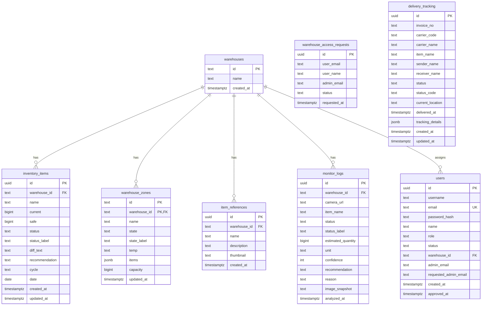

# WMS 데이터베이스 구조도

- 데이터베이스: PostgreSQL 16
- 스키마 정의 파일: `rust-backend/schema.sql`
- 접근 방식: Rust Axum API가 SQLx를 통해 조회/수정

## 1. ER 다이어그램

`delivery_tracking`은 창고 ID로 구분되지 않고 시스템 전역 테이블로 운영된다.

## 2. 테이블 설명

### warehouses

창고 마스터 테이블. 다른 대부분 테이블이 `warehouse_id`로 이 테이블을 참조한다.

| 컬럼 | 타입 | 설명 |
|---|---|---|
| id | text (PK) | 창고 ID, 예: `wh_wjmals` |
| name | text | 창고 이름 |
| created_at | timestamptz | 생성 시각 |

### users

로그인 계정과 역할, 승인 상태를 저장한다.

| 컬럼 | 타입 | 설명 |
|---|---|---|
| id | uuid (PK) | 사용자 ID |
| username | text (unique, nullable) | 로그인용 아이디 |
| email | text (unique) | 이메일 |
| password_hash | text | Argon2 해시 |
| name | text | 표시 이름 |
| role | text | `서버 관리자` \| `관리자` \| `창고지기` |
| status | text | `PENDING_ADMIN` \| `PENDING_WAREHOUSE` \| `APPROVED` |
| warehouse_id | text (FK, nullable) | 승인된 창고 ID |
| admin_email | text (nullable) | 담당 관리자 이메일(창고지기) |
| requested_admin_email | text (nullable) | 접근 요청 중인 관리자 이메일 |
| created_at / approved_at | timestamptz | 생성/승인 시각 |

서버 관리자 계정(`wjmals`)은 현재 코드에 하드코딩되어 있으며 이 테이블에 저장되지 않는다.

### inventory_items

품목별 현재 재고와 안전재고, 서버가 계산한 상태를 저장한다.

| 컬럼 | 타입 | 설명 |
|---|---|---|
| id | uuid (PK) | 품목 ID |
| warehouse_id | text (FK) | 소속 창고 |
| name | text | 품목명 |
| current / safe | bigint | 현재 재고 / 안전재고 |
| status / status_label | text | `shortage` \| `safe` \| `overstock` 및 표시용 라벨 |
| diff_text | text | 부족/초과 수치 텍스트 |
| recommendation | text | 조치 권고 |
| cycle | text | 점검 주기 |
| date | date (nullable) | 기준일 |
| created_at / updated_at | timestamptz | 생성/갱신 시각 |

### warehouse_zones

창고 내 보관 구역 정보를 저장한다. 기본 키는 `(warehouse_id, id)` 복합키다.

| 컬럼 | 타입 | 설명 |
|---|---|---|
| id | text (PK 일부) | 구역 ID |
| warehouse_id | text (PK 일부, FK) | 소속 창고 |
| name | text | 구역 이름 |
| state / state_label | text | 상태 코드/라벨 |
| temp | text | 보관 온도 |
| items | jsonb | 구역 내 품목 메타데이터 |
| capacity | bigint | 최대 용량 |
| updated_at | timestamptz | 갱신 시각 |

### warehouse_access_requests

창고지기가 관리자에게 보낸 접근 요청 이력.

| 컬럼 | 타입 | 설명 |
|---|---|---|
| id | uuid (PK) | 요청 ID |
| user_email / user_name | text | 요청자 정보 |
| admin_email | text | 대상 관리자 |
| status | text | `PENDING` \| `APPROVED` |
| requested_at | timestamptz | 요청 시각 |

### item_references

AI 분석에 사용하는 창고별 레퍼런스 이미지.

| 컬럼 | 타입 | 설명 |
|---|---|---|
| id | uuid (PK) | 레퍼런스 ID |
| warehouse_id | text (FK) | 소속 창고 |
| name | text | 품목명 |
| description | text | 설명 |
| thumbnail | text | base64 이미지 문자열(최대 50,000자) |
| created_at | timestamptz | 등록 시각 |

분석 시 서버는 해당 창고의 레퍼런스를 최대 3개까지 조회해 현재 카메라 이미지와 함께 Groq Vision에 전달한다. 품목명이 일치하는 레퍼런스가 있으면 우선 사용한다.

### monitor_logs

Groq Vision 분석 결과 이력.

| 컬럼 | 타입 | 설명 |
|---|---|---|
| id | uuid (PK) | 로그 ID |
| warehouse_id | text (FK) | 소속 창고 |
| camera_url | text | 카메라 식별자 |
| item_name | text | 감지 품목명 |
| status / status_label | text | 상태 코드/라벨 |
| estimated_quantity | bigint | 추정 수량 |
| unit | text | 단위 |
| confidence | int | AI 신뢰도(0~100) |
| recommendation / reason | text | 권고/판단 근거 |
| image_snapshot | text (nullable) | 원본 이미지 일부 저장 |
| analyzed_at | timestamptz | 분석 시각 |

### delivery_tracking

배송 등록 및 상태 이력. 창고 ID로 구분하지 않는 전역 테이블이다.

| 컬럼 | 타입 | 설명 |
|---|---|---|
| id | uuid (PK) | 배송 ID |
| invoice_no | text | 운송장 번호(숫자만) |
| carrier_code / carrier_name | text | 택배사 코드/이름 |
| item_name | text | 품목명 |
| sender_name / receiver_name | text | 발신/수신자 |
| status / status_code | text | 상태 표시/코드 |
| current_location | text | 현재 위치 |
| delivered_at | timestamptz (nullable) | 배송 완료 시각 |
| tracking_details | jsonb | 상세 이력 |
| created_at / updated_at | timestamptz | 생성/갱신 시각 |

## 3. 관계 요약

- 하나의 `warehouses` 행은 여러 `inventory_items`, `warehouse_zones`, `item_references`, `monitor_logs`, `users`(창고지기/관리자)와 연결된다.
- `warehouse_zones`는 창고 안에서 `id`가 유일하면 되고, 시스템 전체에서는 `(warehouse_id, id)`로 유일하다.
- `delivery_tracking`은 창고와 직접 연결되지 않고 시스템 전역에서 관리된다.
- `users.warehouse_id`가 설정되어야 창고 데이터 접근 화면이 정상 동작한다.

## 4. 인덱스와 제약조건

- `inventory_items_warehouse_idx`: `warehouse_id` 기준 인덱스.
- `users_email_key`: 이메일 유일 제약.
- `users_username_key`: `username`이 NULL이 아닐 때만 유일 제약.
- `inventory_items.status` CHECK 제약: `shortage`, `safe`, `overstock`만 허용.
- 창고 삭제 시 `inventory_items`, `warehouse_zones`, `item_references`, `monitor_logs`는 `ON DELETE CASCADE`로 함께 삭제된다.
- `users.warehouse_id`는 `ON DELETE SET NULL`로, 창고가 삭제되어도 사용자 계정은 유지된다.
