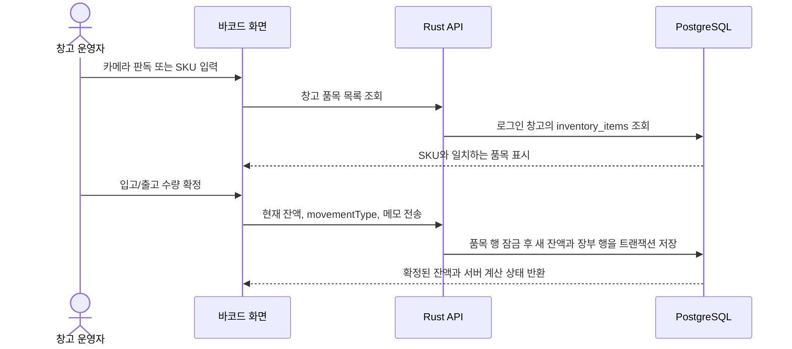

# 재고 데이터 수집 및 저장 안내

- 기준일: 2026년 10월 7일
- 적용 구성: Next.js 화면/API 프록시, Rust Axum API, PostgreSQL 16

이 문서는 WMS 재고 수량이 어디서 들어오고, 서버에서 어떻게 검증되며, PostgreSQL에 어떤 기록으로 남는지를 설명한다. 재고 원본은 PostgreSQL이며 브라우저 `localStorage`는 로그인 화면 표시 정보일 뿐 재고 저장소가 아니다.

## 재고 데이터가 들어오는 경로

| 입력 경로 | 들어오는 데이터 | 저장 방식 |
|---|---|---|
| 재고 품목 등록 화면 | 품목명, 선택 바코드/SKU, 소수 현재 수량, 안전재고, 기준 단위, 포장 단위와 포장 환산량 | `inventory_items` 품목을 만들고 현재 수량을 기초 잔액(`initial`)과 생성 감사 이벤트로 함께 기록 |
| 카메라 또는 바코드 리더기 | 인쇄된 바코드/SKU 문자열 | 코드로 기존 품목을 찾는다. 라벨 인쇄는 품목 코드와 현재 수량을 출력하며 스캔 자체는 재고를 바꾸지 않는다. |
| 바코드 화면 입고/출고 | 품목 ID, 소수 변동량, 기준/포장 단위, 변경 유형, 사유 | 포장 단위를 기준 단위로 환산한 뒤 잔량, 증감 장부, 담당자 감사 이력을 같은 DB 트랜잭션으로 저장 |
| 관리자 수기 재고 조정 | 품목의 새 현재 수량 및 안전재고 | 서버가 기존 잔액과 비교해 조정량을 계산하고 `adjustment` 이력을 기록 |
| 이미지 모니터 분석 | Groq가 반환한 품목명과 추정 현재 수량 | `inventory_vision_estimates`에 승인 대기 추정치로 저장한다. 관리자 승인 전에는 현재 잔량을 변경하지 않는다. |
| 과거 거래 엑셀 가져오기 | 품목, 발생 시각, 입고/출고/조정, 수량/단위, 사유, 참조 | `inventory_movement_import_*` 임시 배치로 저장한다. 관리자 승인 후 기준 잔액과 역산 잔액을 검증해 장부에만 과거 거래를 추가한다. |
| 기존 DB 최초 적용 | 마이그레이션 시점에 DB에 있던 현재 잔액 | 과거 이력이 없는 품목만 현재 잔액을 `initial` 기초 잔액으로 기록. 실제 과거 입출고 이력으로 간주하지 않음 |

엑셀 레퍼런스 가져오기는 모니터의 **분석 참고 이미지**를 등록하는 기능이며, 재고 품목이나 수량을 엑셀에서 일괄 업로드하는 기능은 아니다. 재고 수량은 위 표의 등록/조정 경로로 들어온다.

## 일반 입출고 흐름

카메라가 읽은 문자열이 등록된 SKU와 일치하지 않으면 자동으로 새 품목을 만들지 않는다. 이때 품목의 바코드 값을 먼저 등록하거나 품목 ID/이름으로 검색해야 한다. USB/블루투스 스캐너가 키보드 입력 방식으로 동작하면 검색란에 코드를 입력할 수 있다.

## 서버 검증과 수량 계산

- 재고 수량·안전재고·장부 수량은 `NUMERIC(20,6)` 기반 십진수다. 재고 잔량과 안전재고는 음수를 거부한다.
- 품목은 기준 단위와 선택 포장 단위 및 포장당 기준 수량을 가진다. API와 화면은 기준 단위로 잔량을 저장하고 포장 단위 입력만 환산한다. 서로 정의되지 않은 단위 변환은 거부한다.
- 입고량은 양수 증감, 출고량은 음수 증감으로 장부에 기록한다. 조정은 부호를 포함한다. 출고로 잔액이 음수가 되면 API/DB 검증에서 거부된다.
- 안전재고 상태는 Rust API에서 다시 계산한다. `current < safe × 0.5`는 부족, `safe × 0.5 ≤ current ≤ safe × 2`는 적정, `current > safe × 2`는 과다다.
- `barcode`는 선택 입력이다. 값이 있는 경우 같은 창고 안에서 중복을 허용하지 않으며, 서로 다른 창고에서는 같은 코드를 사용할 수 있다.
- 브라우저가 보낸 창고 ID를 권한 근거로 신뢰하지 않는다. Rust API가 JWT 세션과 사용자 DB의 창고 배정을 확인하고 다른 창고 접근을 거부한다.

## 저장 구조

### `inventory_items`: 현재 잔액

한 행은 한 창고의 한 품목을 나타낸다. 주요 필드는 품목 UUID, `warehouse_id`, `name`, 선택 `barcode`, 기준 `unit`, 선택 `package_unit`, 기준 단위로 환산되는 `package_size`, `current`, `safe`, 서버가 계산한 상태, 생성·수정·보관 시각이다. 창고와 활성 바코드 조합에는 부분 고유 인덱스가 적용된다.

### `inventory_movements`: 증감 장부

수량이 바뀔 때마다 별도 행을 추가한다. 주요 필드는 창고 ID, 품목 ID와 당시 품목명, 변동 종류, 증감량, 변경 후 잔액, 사유, 출처, 담당자 ID/이메일, 기록 시각이다.

| `movement_type` | 의미 |
|---|---|
| `initial` | 새 품목 등록 또는 최초 마이그레이션 기준 잔액 |
| `inbound` | 입고. 증감량은 양수 |
| `outbound` | 출고. 장부 증감량은 음수, 화면 추이는 양수 출고량으로 집계 |
| `adjustment` | 실사 차이 등 수기 조정 |
| `vision_estimate` | 사람이 승인한 이미지 분석 추정치가 반영된 재고 변경 |

승인된 과거 행은 원래 `inbound`/`outbound`/`adjustment` 유형을 유지하고 `source`에 가져오기 배치 식별자를 기록한다. 스키마의 `historical_import` 유형 값은 향후 전용 분류를 위한 허용 값이며 현재 가져오기 승인기는 원래 거래 유형을 보존한다.

품목 잔액 수정과 장부 행 추가는 하나의 PostgreSQL 트랜잭션에서 실행한다. 장부는 품목 외래 키의 `RESTRICT`로 보호한다. 화면의 품목 삭제 동작은 `archived_at`을 기록하는 보관 처리이며, 장부와 감사 이벤트를 물리 삭제하지 않는다.

### 과거 거래와 승인

엑셀 가져오기는 바로 재고나 공식 장부를 바꾸지 않는다. 제출 행은 검증 후 대기 배치로 저장된다. 관리자가 승인하면 가져온 수량을 역산해 기준 장부 잔액과 일치하는지 확인하고, 중간 잔량이 음수가 되거나 기준 최초 거래보다 늦은 거래가 포함되면 승인 전체를 롤백한다. 승인된 과거 행은 원래 발생 시각, 사유, 참조, 배치 출처와 승인자를 가진 장부 행으로 추가되며 현재 `inventory_items.current`는 변경하지 않는다.

### 비전 승인

모델 출력은 `inventory_vision_estimates`에 신뢰도·근거·이미지 일부·제출자와 함께 `PENDING`으로 저장된다. 창고 관리자 또는 서버 관리자가 품목을 지정해 승인하거나 사유와 함께 반려한다. 승인만 현재 잔량, `vision_estimate` 장부, 감사 이벤트를 한 트랜잭션으로 기록한다.

## 대시보드의 이력과 추세

`GET /api/inventory/movements?warehouseId=<id>&days=30`은 요청한 기간의 날짜별 입고량, 출고량, 기타 조정량과 실제 변동 건수를 돌려준다. 기간은 1~365일로 제한된다. 기간 안에 변동이 없으면 0으로 표시한다.

대시보드는 실제 이력의 입고·출고 선과 기록된 구간 간 출고 추세만 보여준다. 기존 잔액을 일수로 나눠 평균 소비량을 만들어내거나, 합성 곡선으로 미래 수요를 예측하지 않는다. 현재 모델 기반 미래 수요 예측과 권장 발주량은 구현되어 있지 않다.

## 기존 데이터와 시간 범위

새 장부 기능을 처음 켤 때 기존 `inventory_items` 행마다 현재 잔액을 기준 `initial` 행으로 한 번 기록한다. 이 마이그레이션은 누락 행만 채우므로 재시작해도 중복 기초 잔액을 만들지 않는다. 이 기준 이전의 과거 입고·출고는 데이터베이스에 없으므로 복원되지 않으며, 새 기록부터 실제 변동 추이를 계산할 수 있다.

## 데이터 확인 및 백업

- 앱에서는 대시보드의 품목 현재량과 최근 30일 입출고 추이를 확인한다.
- SQL 관리자 도구에서는 `inventory_items`를 현재 잔액 원장으로, `inventory_movements`를 증감 원장으로 확인한다. 품목과 장부를 비교할 때는 창고 ID와 품목 UUID를 함께 사용한다.
- 저장소 정의와 초기화 순서는 `rust-backend/schema.sql`, 기존 설치에 적용되는 호환 변경은 Rust API 시작 시 실행되는 마이그레이션 코드가 기준이다.
- 데이터베이스 백업에는 두 테이블을 함께 포함한다. 화면 표시만 캡처한 파일은 재고 원장 백업을 대체하지 않는다.
- 테스트 데이터나 임시 품목도 같은 운영 테이블에 저장되므로 실창고 테스트 후 제거 여부를 확인한다.

## 운영 주의

- 과거 장부는 엑셀 원본이 있는 구간만 복원할 수 있다. 기존 최초 기초 잔액보다 앞선 거래가 없으면 그 이전의 실제 이력은 만들어낼 수 없다.
- 구역 점유량은 구역의 `capacityUnit`과 같은 기준 단위를 가진 배치 품목만 합산한다. 서로 다른 단위의 물리적 용량 환산은 별도 변환 정의 없이는 추측하지 않는다.
- 비전 모델 추정은 실측값이 아니다. 운영자가 실물 확인 후 승인해야 현재 재고에 반영된다.
- 감사 및 장부 테이블의 보존·백업 권한은 운영 환경에서도 제한해야 한다. 창고 삭제 시 창고 자체의 FK 정책은 별도 운영 삭제 절차로 통제한다.
